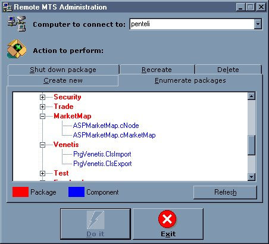



## Remote MTS Administration

### Description

This is a utility that allows you to perform simple administration tasks on the MTS packages of your computer or any remote computer connected to the network.

The program requires the VB6 Service Pack 3 version of the following files:

COMDLG32.OCX

MSCOMCTL.OCX

and also references the MTSAdmin library

MTXADMIN.DLL

that shoud normally reside in the MTS subfolder of your System folder.
 
### More Info
 

             |
---                |---
**Submitted On**   |2000-06-02 17:35:14
**By**             |[Theo Kandiliotis](https://github.com/Planet-Source-Code/PSCIndex/blob/master/ByAuthor/theo-kandiliotis.md)
**Level**          |Advanced
**User Rating**    |5.0 (15 globes from 3 users)
**Compatibility**  |VB 5\.0, VB 6\.0
**Category**       |[Complete Applications](https://github.com/Planet-Source-Code/PSCIndex/blob/master/ByCategory/complete-applications__1-27.md)
**World**          |[Visual Basic](https://github.com/Planet-Source-Code/PSCIndex/blob/master/ByWorld/visual-basic.md)
**Archive File**   |[CODE\_UPLOAD6343622000\.zip](https://github.com/Planet-Source-Code/theo-kandiliotis-remote-mts-administration__1-8277/archive/master.zip)

